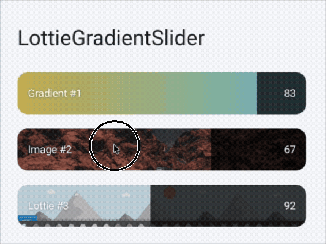

# LottieGradientSlider



`LottieGradientSlider` is an Android custom slider view that supports three background types:

- Gradient
- Image URL or drawable resource
- Lottie JSON/dotLottie URL or raw resource

It is designed for expressive audio, mood, ambience, and mixer-style controls where a normal `SeekBar` feels too plain.

## Features

- Reusable Android custom slider view
- Gradient, remote image, and remote Lottie backgrounds
- Optional reversed progress for volume/mixer UX
- Content scrim and text shadow options for readable labels on bright backgrounds
- Adjustable corner radius
- Smooth overlay animation on tap, immediate overlay updates while dragging
- XML attributes and Kotlin API
- JitPack-ready publishing setup
- Sample app included

## Installation

Add JitPack to your repositories:

```kotlin
dependencyResolutionManagement {
    repositoriesMode.set(RepositoriesMode.FAIL_ON_PROJECT_REPOS)
    repositories {
        google()
        mavenCentral()
        maven("https://jitpack.io")
    }
}
```

Add the dependency:

```kotlin
dependencies {
    implementation("com.github.SeonghwiShin.LottieGradientSlider:slider:0.1.5")
}
```

## Usage

### XML

```xml
<io.github.seonghwishin.lottiegradientslider.LottieGradientSliderView
    android:id="@+id/moodSlider"
    android:layout_width="match_parent"
    android:layout_height="48dp"
    app:lgs_title="Rain"
    app:lgs_progress="70"
    app:lgs_max="200"
    app:lgs_reverseProgress="true"
    app:lgs_cornerRadius="14dp"
    app:lgs_contentScrimColor="#33000000"
    app:lgs_titlePaddingStart="16dp"
    app:lgs_valuePaddingEnd="16dp"
    app:lgs_overlayAnimationDuration="120"
    app:lgs_gradientStartColor="#38D790"
    app:lgs_gradientEndColor="#4A79F1" />
```

### Kotlin

```kotlin
moodSlider.title = "Rain"
moodSlider.maxValue = 200
moodSlider.progress = 70
moodSlider.setCornerRadiusDp(14f)
moodSlider.contentScrimColor = 0x33000000
moodSlider.setTextHorizontalPaddingDp(titleStartDp = 16f, valueEndDp = 16f)
moodSlider.overlayAnimationDuration = 120L
moodSlider.setGradient(
    Color.parseColor("#38D790"),
    Color.parseColor("#4A79F1")
)
moodSlider.setOnValueChangeListener { value, fromUser ->
    // Update your player volume, filter intensity, or mood value.
}
```

Image background:

```kotlin
moodSlider.setImageUrl("https://example.com/background.png")
moodSlider.setImageResource(R.drawable.slider_background)
```

Lottie background:

```kotlin
moodSlider.setLottieUrl("https://example.com/background.json")
moodSlider.setLottieUrl("https://example.com/background.lottie")
moodSlider.setLottieRawResource(R.raw.slider_animation)
```

The sample app uses a GitHub-hosted Lottie JSON asset:

```kotlin
moodSlider.setLottieUrl(
    "https://raw.githubusercontent.com/SeonghwiShin/LottieGradientSlider/main/sample-assets/background-animation-by-bajutech.json"
)
```
